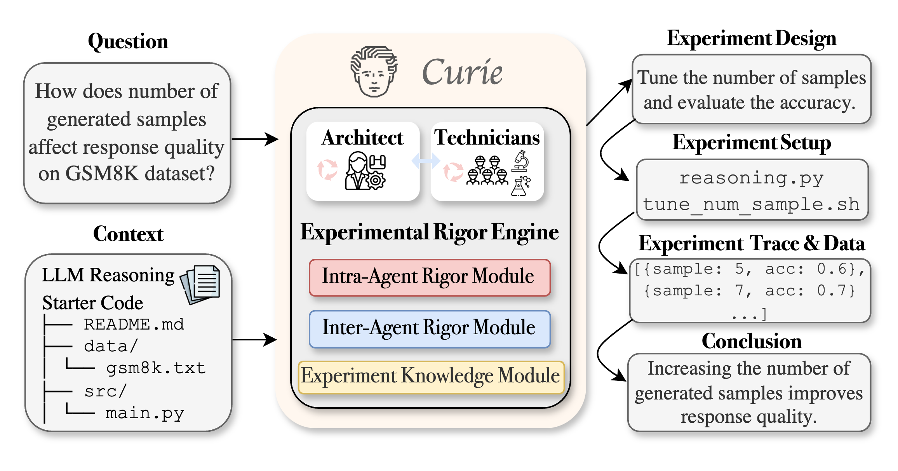
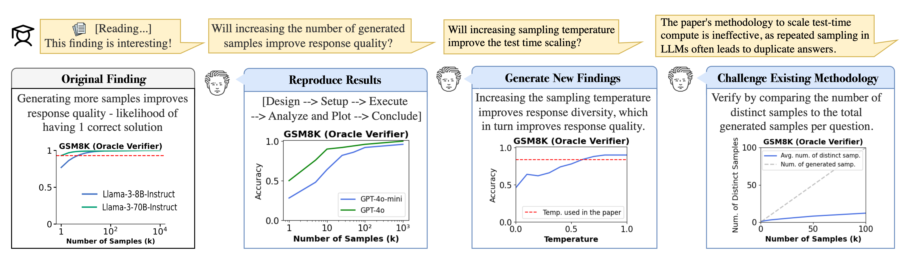

# Curie: Automate Rigorous Scientific Experimentation

[](https://arxiv.org/abs/2502.16069)
[](LICENSE)
[](https://join.slack.com/t/just-curieous/shared_invite/zt-313elxhhy-hpEK5r9kX9Xv1Pfxzt9CJQ)


Curie is the first AI-agent framework designed for automated and rigorous scientific experimentation. 
Curie helps answer your curiosity through end-to-end experimentation automation, ensuring that every step—from hypothesis formulation to result interpretation—is conducted with precision, reliability, and reproducibility.
<p align="center">
  
</p>

**Key Features**
- 🚀 Automated Experimentation – End-to-end workflow management: hypothesis formulation, experiment setup, experiment execution, result analysis and finding reflection.
- 📊 Rigor Enhancement - Built-in verification modules enforce methodical procedure, reliability and interpretability.
- 🔬 Broad Applicability – Supports ML research, system analysis, and scientific discovery.
- 📖 Experimentation Benchmark - Provide 46 questions from 4 Computer Science domains, based on influential papers and open-source projects (`benchmark/experimentation_bench`).

## Table of Contents 
- [Installation](#installation)
- [Quick Start](#quick-start)
- [Use Cases](#use-cases)
- [Tutorial](#tutorial)
- [Customize Your Experiment Agents](#customize-your-experimentation-agents) 

## Installation

1. Install docker: https://docs.docker.com/engine/install/ubuntu/. 
Grant permission to docker via `sudo chmod 666 /var/run/docker.sock`. Run `docker ps` to check the permission with the Docker daemon.

2. Clone the repository:
```
git clone https://github.com/Just-Curieous/Curie.git
cd Curie
```

3. Put your LLM API credentials under `curie/setup/env.sh`. Example: 

```
export MODEL="gpt-4o" 
export OPENAI_API_KEY="sk-xxx" 
```

4. Build the container image. This will take a few minutes. Note: you may need to setup a virtual environment before running pip install.

```bash
pip install -e .
cd curie && docker build --no-cache --progress=plain -t exp-agent-image -f ExpDockerfile_default .. && cd -
```

## Quick Start
Use the following command to input your research question or problem statement: `python3 -m curie.main -q "<Your research question>"`.

### **Example 1**: Understanding Sorting Algorithm Efficiency

```bash
python3 -m curie.main \
  -q "How does the choice of sorting algorithm impact runtime performance across different \
  input distributions (random, nearly sorted, reverse sorted)?" --report
``` 

- **Estimated runtime**: ~5 minutes
- **Sample log file**: Available [here](./docs/example_logs/research_sorting_efficiency_20250310015235.log)
- **Experiment report**: Available [here](./docs/example_logs/research_sorting_efficiency_20250310015235.md).
- **Log monitoring**:
  - Real-time logs are streamed to the console.
  - Logs are also stored in:
    - `logs/research_question_<ID>.log` 
    - `logs/research_question_<ID>_verbose.log`
  - Experiment report details:
    - Stored in: `logs/research_question_<ID>.md`
    - Will only be produced when the `--report` flag is used.
- **Reproducibility**: The full experimentation process is saved in `workspace/research_<ID>/`.

## **Example 2**: Find good ML strategies for noisy data.

```bash
python3 -m curie.main \
  -q "Are ensemble methods (e.g., Random Forests, Gradient Boosting) more robust to added noise \
  in the Breast Cancer Wisconsin dataset compared to linear models like Logistic Regression \
  for a binary classification task?"
```

More example questions can be found [here](./docs/quick_start.md).


## Tutorial
- [How to reproduce the results in `Large Language Monkeys'. ](./docs/tutorial-large-language-monkey.md)


## Use Cases
Curie is designed for scientific discovery across multiple domains:

- 🔬 Machine Learning & AI Research – Hyperparameter tuning and algorithm behavior
  - [How does the optimal learning rate change with the increase of model size?](https://github.com/microsoft/mup)
  - [How does repeated sampling in LLM inference affect the quality of response?](https://arxiv.org/abs/2407.21787)
- 💻 System Performance Analysis – Benchmarking systems, optimizing configurations, investigating system trade-offs.
  - [What configurations affects the energy consumption of LLM serving?](https://ml.energy/leaderboard/?__theme=light)
  - [How does the request bursty arrival pattern affects the user experience in LLM serving?](https://arxiv.org/abs/2404.16283)
- 🧪 Algorithmic & Scientific Discovery – Validating hypotheses, automating computational simulations.
 
<p align="center">
  
</p>


## Customize Your Experimentation Agents

Config `curie/configs/base_config.json` to adapt to your own tasks:  
- Add your domain-specific instructions by customizing `supervisor_system_prompt_filename` for the supervisor, `control_worker_system_prompt_filename` for the experimentation worker, and so on.
- Human interruption in the experiment design phase can be activated by setting the `is_user_interrupt_allowed` key to `true`.
- Configure timeouts and maximum number of steps (global, and coding agent specific).

## Community and Support

For any issues or feature requests, please open an issue on our [GitHub Issues](https://github.com/Just-Curieous/curie/issues) page.

## License

Curie is released under the Apache 2.0 License. See `LICENSE` for more details.

