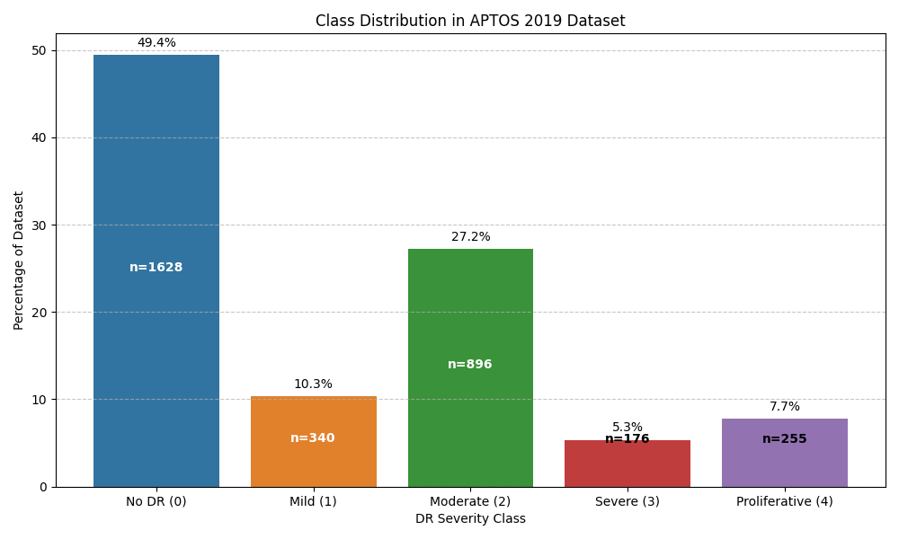
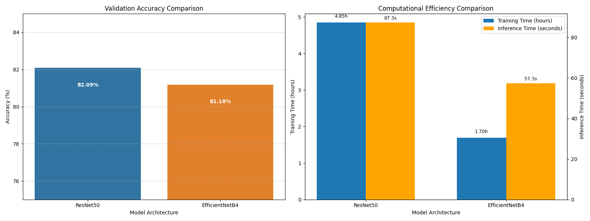
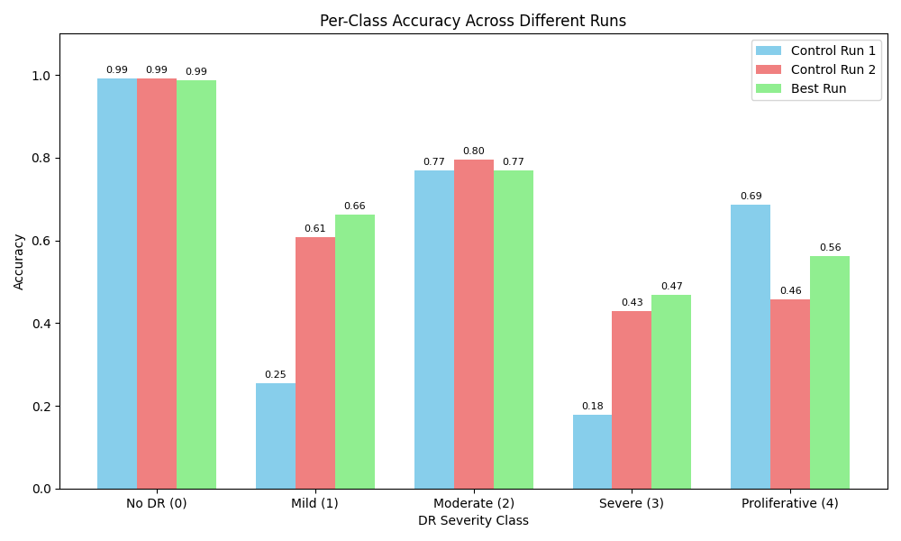

# APTOS 2019 Blindness Detection
> Prerequisites: Ensure you have installed `mlebench` following [instructions](../README.md).

Given a dataset of retinal images, predict the severity level of diabetic retinopathy on a scale of 0 to 4. This is a multi-class classification task with medical significance.

## Dataset Overview

The APTOS 2019 Blindness Detection dataset contains high-resolution retinal images, classified into five severity levels:
- 0: No diabetic retinopathy
- 1: Mild diabetic retinopathy
- 2: Moderate diabetic retinopathy
- 3: Severe diabetic retinopathy
- 4: Proliferative diabetic retinopathy

This challenge addresses a critical healthcare issue as millions of people suffer from diabetic retinopathy, the leading cause of blindness among working-aged adults. Early detection can prevent blindness.

## Download Dataset

```bash
mlebench prepare -c aptos2019-blindness-detection
```

## Run Curie
- Update the configuration: Open `curie/configs/mle-aptos-config.json` and verify the paths to the dataset and starter code.
- Execute Curie:
```bash
cd Curie/
python3 -m curie.main -f benchmark/mle_bench/aptos2019-blindness-detection/aptos2019-blindness-detection-question.txt --task_config curie/configs/mle_config.json --dataset_dir /home/amberljc/.cache/mle-bench/data/aptos2019-blindness-detection/prepared/public 
```
- Change `--dataset_dir` to the absolute path to your dataset. 

## Curie Results

After asking Curie to solve this question, the following output files are generated:
- [`Report`](./aptos2019-blindness-detection_20250522225727_iter1.md): Auto-generated report with experiment design and findings  
- [`Experiment results`](./aptos2019-blindness-detection_20250522225727_iter1_all_results.txt): All detailed results for all conducted experiments
- [`Curie logs`](https://github.com/Just-Curieous/Curie-Use-Cases/blob/main/machine_learning/q4-aptos2019-blindness-detection/aptos2019-blindness-detection_20250522225727_iter1.log): Execution log file  
- [`Curie workspace`](https://github.com/Just-Curieous/Curie-Use-Cases/tree/main/machine_learning/q4-aptos2019-blindness-detection): Generated code, complete script to reproduce and raw results (excluding the model checkpoint).

### Curie Performance Summary
#### Data Understanding and Preprocessing

We used the APTOS 2019 Kaggle dataset, which consists of 3,662 high-resolution retinal images (3,295 for training and 367 for testing). The dataset exhibits significant class imbalance:
- Class 0 (No DR): 1,628 images (49.41%)
- Class 1 (Mild): 340 images (10.32%)
- Class 2 (Moderate): 896 images (27.19%)
- Class 3 (Severe): 176 images (5.34%)
- Class 4 (Proliferative): 255 images (7.74%)




Multiple preprocessing techniques were implemented and evaluated:

1. **Basic Normalization**: Standard image normalization using ImageNet mean and standard deviation values
2. **CLAHE Enhancement**: Contrast Limited Adaptive Histogram Equalization to improve visibility of retinal features
3. **Circular Crop**: Removing irrelevant black borders around the retinal image

All images were resized to the input dimensions required by each model architecture (224×224 pixels for most models).


#### Model Performance 


- Overall Performance

The EfficientNetB4 model with CLAHE preprocessing achieved the best performance:
- Validation Quadratic Weighted Kappa: 0.9096
- Validation Accuracy: 0.8376
- Best performance at epoch 8 (of 18 total epochs)
- Total training time: 113 minutes



- 3.2 Per-class Performance

The model demonstrated varying accuracy across different DR severity grades:
- Class 0 (No DR): 98.78% accuracy
- Class 1 (Mild): 66.15% accuracy
- Class 2 (Moderate): 76.88% accuracy
- Class 3 (Severe): 46.88% accuracy
- Class 4 (Proliferative): 56.25% accuracy




For complete details on methodology, experiments, and analysis, refer to the generated [report](./aptos2019-blindness-detection_20250522225727_iter1.md)