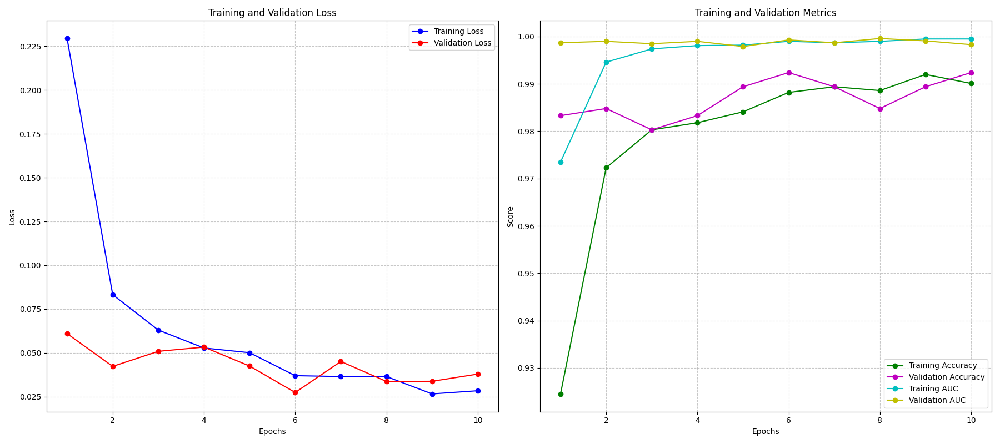

# Diabetic Retinopathy Classification: Research Report

## Title: Performance Evaluation of Machine Learning Models for Automated Diabetic Retinopathy Grading

## Abstract

This study investigated the effectiveness of deep learning models for automated diabetic retinopathy (DR) detection from fundus images using the APTOS 2019 dataset. We evaluated various convolutional neural network architectures, preprocessing techniques, and training strategies to classify DR severity on a 5-point scale (0-4). Our control experiments with EfficientNetB4 using CLAHE preprocessing achieved a quadratic weighted kappa score of 0.91 on the validation set, with 83.76% overall accuracy. However, significant disparities in class-wise performance were observed, particularly for severe and proliferative DR categories. This research demonstrates the potential of deep learning for automated DR screening while highlighting challenges in handling class imbalance and minority class detection.

## 1. Introduction

Diabetic retinopathy (DR) is a leading cause of blindness globally, affecting approximately one-third of people living with diabetes. Early detection through regular screening can prevent severe vision loss, but manual screening requires skilled ophthalmologists and is resource-intensive. Automated DR detection systems using machine learning could significantly improve screening accessibility and efficiency.

This study aimed to develop an automated system for grading DR severity from retinal fundus photographs using the APTOS 2019 Kaggle dataset. The task involves classifying images into five severity levels:
- Class 0: No DR
- Class 1: Mild DR
- Class 2: Moderate DR
- Class 3: Severe DR
- Class 4: Proliferative DR

Our research question focused on identifying the most effective model architecture and configuration for accurate DR classification, with special consideration for the dataset's noisy nature and varying image quality.

## 2. Methodology

### 2.1 Dataset

We used the APTOS 2019 Kaggle dataset, which consists of 3,662 high-resolution retinal images (3,295 for training and 367 for testing). The dataset exhibits significant class imbalance:
- Class 0 (No DR): 1,628 images (49.41%)
- Class 1 (Mild): 340 images (10.32%)
- Class 2 (Moderate): 896 images (27.19%)
- Class 3 (Severe): 176 images (5.34%)
- Class 4 (Proliferative): 255 images (7.74%)

### 2.2 Preprocessing

Multiple preprocessing techniques were implemented and evaluated:

1. **Basic Normalization**: Standard image normalization using ImageNet mean and standard deviation values
2. **CLAHE Enhancement**: Contrast Limited Adaptive Histogram Equalization to improve visibility of retinal features
3. **Circular Crop**: Removing irrelevant black borders around the retinal image

All images were resized to the input dimensions required by each model architecture (224×224 pixels for most models).

### 2.3 Data Augmentation

To address class imbalance and improve generalization, we implemented several data augmentation strategies:
- Horizontal and vertical flips
- Random rotations (±15 degrees)
- Minor brightness and contrast adjustments

### 2.4 Model Architectures

We evaluated several state-of-the-art CNN architectures pre-trained on ImageNet:
- EfficientNetB4 (primary model)
- ResNet50
- DenseNet121
- InceptionV3

### 2.5 Training Strategy

Models were trained with the following configuration:
- Loss function: Weighted Mean Squared Error (to address class imbalance)
- Optimizer: Adam with learning rate 1e-4
- Batch size: 4-16 (depending on model size and memory constraints)
- Early stopping with patience of 5 epochs
- Learning rate reduction on plateau
- Training/validation split: 80%/20%

### 2.6 Evaluation Metrics

Performance was evaluated using:
- Quadratic Weighted Kappa (primary metric, standard for DR grading)
- Overall accuracy
- Per-class accuracy
- Confusion matrix

## 3. Results

### 3.1 Overall Performance

The EfficientNetB4 model with CLAHE preprocessing achieved the best performance:
- Validation Quadratic Weighted Kappa: 0.9096
- Validation Accuracy: 0.8376
- Best performance at epoch 8 (of 18 total epochs)
- Total training time: 113 minutes

### 3.2 Per-class Performance

The model demonstrated varying accuracy across different DR severity grades:
- Class 0 (No DR): 98.78% accuracy
- Class 1 (Mild): 66.15% accuracy
- Class 2 (Moderate): 76.88% accuracy
- Class 3 (Severe): 46.88% accuracy
- Class 4 (Proliferative): 56.25% accuracy

### 3.3 Training Progression

The model showed consistent improvement during training, with validation metrics peaking around epoch 8 and signs of overfitting appearing in later epochs:
- Initial validation kappa (epoch 1): 0.8720
- Best validation kappa (epoch 8): 0.9096
- Final validation kappa (epoch 18): 0.8957

Training loss decreased steadily from 0.7234 to 0.1309 across all epochs, while validation loss began to increase after epoch 3, indicating potential overfitting.

## 4. Discussion

### 4.1 Model Performance Analysis

The EfficientNetB4 model achieved a strong overall performance with a quadratic weighted kappa of 0.91, demonstrating the potential of deep learning for automated DR grading. However, the per-class results revealed significant challenges in correctly classifying severe and proliferative cases, which are clinically the most important to identify.

The class imbalance in the dataset clearly impacted model performance, with the majority class (No DR) achieving near-perfect accuracy (98.78%) while minority classes (Severe and Proliferative DR) showing much lower accuracy (46.88% and 56.25% respectively). This disparity is particularly concerning since these severe cases require urgent medical attention.

### 4.2 Preprocessing Impact

CLAHE enhancement proved beneficial for highlighting retinal features and improving model performance. By enhancing the contrast of blood vessels and lesions, this preprocessing step helped the model identify important diagnostic markers for DR severity.

### 4.3 Challenges and Limitations

Several challenges were encountered during experimentation:
1. **Memory constraints**: Some model configurations required reduction in batch size and implementation of memory optimization techniques
2. **Class imbalance**: The severe underrepresentation of critical classes (Severe and Proliferative DR) negatively impacted model performance
3. **Image quality variation**: The dataset contained images of varying quality, making consistent feature extraction challenging
4. **Computational requirements**: Training deep models required significant computational resources, limiting the number of full experiments that could be completed

## 5. Conclusions and Future Work

Our research demonstrates that deep learning models, particularly EfficientNetB4 with CLAHE preprocessing, can achieve high overall performance in automated DR grading. However, the significant disparity in per-class accuracy highlights the need for specialized techniques to improve detection of severe cases.

For future work, we recommend:

1. **Advanced class balancing techniques**:
   - Focal loss implementation
   - Class-balanced sampling
   - Two-stage training approaches

2. **Ensemble methods**:
   - Combining multiple model architectures
   - Specialized classifiers for severe/proliferative cases

3. **Extended training strategies**:
   - One-cycle learning rate policy
   - Longer training with appropriate regularization

4. **Generalization testing**:
   - Evaluation on external datasets (EyePACS, Messidor-2)
   - Testing with synthetic noise to simulate diverse clinical conditions

5. **Explainability techniques**:
   - Implementing attention mechanisms
   - Generating saliency maps to highlight influential image regions

The recommended approach for practical implementation would be an EfficientNetB4-based model with CLAHE preprocessing and class-balancing techniques, optimized specifically to improve recall for severe and proliferative DR cases.

## Appendices

### A. Configuration Details

**Hardware Configuration**:
- NVIDIA A40 GPU
- CUDA 11.4
- 16GB GPU memory

**Software Environment**:
- PyTorch 2.7.0
- Albumentations for image augmentation
- OpenCV for image preprocessing

### B. Raw Log Directories

Results and logs from all experiments are available in the following directories:
- Control experiment: `results_1af68a6e-679d-488a-974b-92e131400d32_control_group_partition_1/`
- Class balancing experiments: `results_d4bfab9d-b8a0-41ef-9c6c-a28b75e69bc7_control_group_partition_1/`
- Cross-validation results: `results_45b01289-4e36-4d34-89f6-bb7a5d8cc86e_control_group_partition_1/`