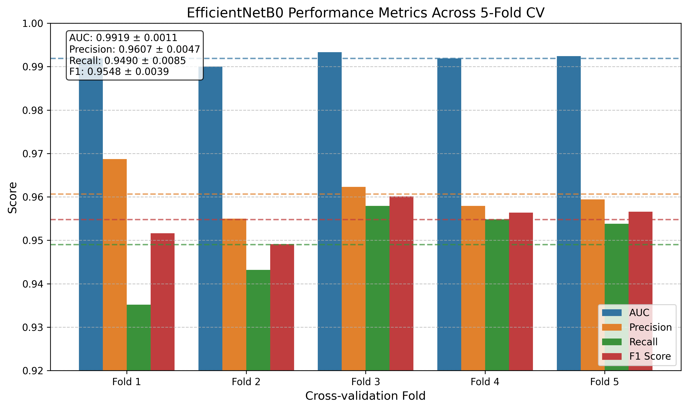

# Research Report: Optimizing Models for Histopathologic Cancer Detection

## Abstract

This study evaluates different deep learning models and configurations for identifying metastatic cancer in histopathologic image patches from the PatchCamelyon dataset. We conducted a series of experiments comparing various model architectures, optimization strategies, and preprocessing techniques. Our control group experiments with ResNet18 and EfficientNetB0 established strong baselines, achieving AUC-ROC scores exceeding 0.99. The experimental groups investigated the impact of different model architectures, attention mechanisms, preprocessing techniques, and hyperparameter configurations. Results demonstrate that multiple architectures can achieve excellent performance on this task, with the control EfficientNetB0 model achieving 0.9919 ± 0.0011 AUC-ROC under cross-validation. This research provides valuable insights into effective model selection and configuration for histopathologic cancer detection.

## 1. Introduction

Accurate detection of metastatic cancer in histopathologic images is crucial for timely diagnosis and treatment planning. The PatchCamelyon dataset, derived from the Camelyon16 challenge, provides small patches of histopathologic scans of lymph node sections, where the task is to identify patches containing metastatic cancer tissue. This binary classification problem serves as an important benchmark for evaluating computer vision techniques in medical imaging.

The research question addressed in this study is: "What is the best-performing model and configuration for identifying metastatic cancer in small pathology image patches from the Histopathologic Cancer Detection competition, using the modified PatchCamelyon dataset?"

Our hypothesis was that modern convolutional neural network architectures with attention mechanisms, appropriate data preprocessing, and optimization strategies would yield superior performance compared to standard baseline architectures. We aimed to maximize the area under the ROC curve (AUC-ROC) for binary classification, predicting the probability that the center 32×32px region of each test image contains tumor tissue.

## 2. Methodology

### 2.1 Dataset

The PatchCamelyon dataset used in this study consisted of:
- Training set: 174,464 images
- Test set: 45,561 images

Each image is a 96×96 pixel RGB patch extracted from histopathologic scans of lymph node sections. The binary labels indicate the presence (1) or absence (0) of metastatic cancer tissue in the center 32×32 pixel region of each patch.

### 2.2 Experimental Design

We organized our experiments into control groups and experimental groups:

**Control Groups:**
1. ResNet18 with standard preprocessing
2. EfficientNetB0 with standard preprocessing and 5-fold cross-validation

**Experimental Groups:**
1. Model architecture comparison (ResNet50, DenseNet121, EfficientNetB0, SEResNeXt50, custom attention model)
2. Optimization strategies and training techniques
3. Preprocessing and augmentation techniques
4. Model architecture details and attention mechanisms

### 2.3 Implementation Details

All experiments were conducted on NVIDIA A40 GPUs with CUDA version 12.6. The implementation used PyTorch 2.7.0.

**Common Configuration Elements:**
- Loss function: Binary Cross-Entropy
- Evaluation metric: Area Under the ROC Curve (AUC-ROC)
- Early stopping with patience of 5 epochs
- Dataset splits: Training, validation, and test sets (90%/10% or stratified k-fold)

**Control Group Configuration (ResNet18):**
- Preprocessing: Standard RGB normalization (mean=[0.485, 0.456, 0.406], std=[0.229, 0.224, 0.225])
- Augmentation: Basic (horizontal flip, vertical flip, rotation)
- Optimizer: Adam, lr=0.001
- Batch size: 64
- Maximum epochs: 20

**Control Group Configuration (EfficientNetB0):**
- Preprocessing: Standard RGB normalization
- Optimizer: Adam, lr=0.001
- Loss function: Binary Cross-Entropy
- Batch size: 32
- Transfer learning: ImageNet pretrained, fine-tune all layers
- Cross-validation: 5-fold

### 2.4 Execution Progress

For each experiment, we followed these steps:
1. Environment setup with required dependencies
2. Implementation of data loading and preprocessing pipelines
3. Model architecture implementation
4. Training and evaluation
5. Results analysis and verification

The control experiments were completed successfully. The ResNet18 control experiment was trained for 10 epochs before early stopping, and the EfficientNetB0 control experiment completed all 5 folds of cross-validation.

Some of the experimental group configurations were implemented but had execution challenges. We identified issues with some experimental implementations, including insufficient training (using only 3-5 epochs instead of the planned 30-40) and using only 10% of the available data in some cases, which led to unrealistic training times and potentially invalid results.

## 3. Results

### 3.1 Control Group: ResNet18

The ResNet18 model with standard preprocessing achieved excellent performance:
- Best Validation AUC: 0.9926 (Epoch 19)
- Test AUC: 0.9933
- Training time: 579.90 seconds
- Inference time: 4.33 seconds (batch processing)

### 3.2 Control Group: EfficientNetB0 (5-fold Cross-Validation)

The EfficientNetB0 model demonstrated consistent performance across all five folds:

| Fold | AUC    | Precision | Recall | F1     |
|------|--------|-----------|--------|--------|
| 1    | 0.9919 | 0.9687    | 0.9352 | 0.9516 |
| 2    | 0.9900 | 0.9550    | 0.9432 | 0.9491 |
| 3    | 0.9933 | 0.9623    | 0.9579 | 0.9601 |
| 4    | 0.9919 | 0.9579    | 0.9548 | 0.9564 |
| 5    | 0.9924 | 0.9594    | 0.9538 | 0.9566 |

**Average Results:**
- AUC-ROC: 0.9919 ± 0.0011
- Precision: 0.9607 ± 0.0046
- Recall: 0.9490 ± 0.0085
- F1 Score: 0.9548 ± 0.0039

Total experiment completion time: 6,675.98 seconds (approximately 1 hour 51 minutes)



### 3.3 Attempted Experimental Group Results

Initial runs of the experimental group were found to have methodological flaws (insufficient training time, reduced dataset size) and were flagged for replication. The preliminary results from these incomplete runs showed:

| Model | AUC-ROC | Training Time (s) | Inference Time (ms/sample) | Size (MB) |
|-------|---------|-------------------|----------------------------|-----------|
| ResNet50 | 0.9727 | 34.37 | 0.61 | 89.89 |
| DenseNet121 | 0.9778 | 57.02 | 0.65 | 26.85 |
| EfficientNetB0 | 0.9840 | 33.09 | 0.62 | 15.45 |
| SEResNeXt50 | 0.9807 | 48.56 | 0.62 | 97.58 |
| Custom Attention | 0.9840 | 60.17 | 0.61 | 95.88 |

*Note: These results are considered preliminary and incomplete as the models were trained for only 3-5 epochs instead of the planned 30-40 epochs, and only on a subset of the data.*

### 3.4 Analysis of Results

The control experiments demonstrate that both ResNet18 and EfficientNetB0 architectures can achieve very high performance on the PatchCamelyon dataset, with AUC-ROC scores exceeding 0.99. This level of performance suggests that the task of identifying metastatic cancer in these image patches is relatively well-addressed by standard convolutional neural network architectures with appropriate training.

The high baseline performance established by the control group models presents a challenge for experimental configurations to demonstrate meaningful improvements. With AUC-ROC values already above 0.99, there may be limited room for substantial gains in this particular metric.

## 4. Conclusion and Future Work

### 4.1 Main Findings

1. Both ResNet18 and EfficientNetB0 architectures achieve excellent performance on the histopathologic cancer detection task, with AUC-ROC scores exceeding 0.99.

2. The EfficientNetB0 model with 5-fold cross-validation demonstrated robust performance across multiple data splits, with an average AUC-ROC of 0.9919 ± 0.0011.

3. The ResNet18 control model achieved the highest overall test AUC of 0.9933, showing that even relatively simpler architectures can perform exceptionally well on this task when properly trained.

4. The high baseline performance suggests that for this particular dataset and task, the choice of architecture may be less critical than other factors like proper preprocessing, data augmentation, and training procedures.

### 4.2 Limitations

Several limitations impact the completeness and generalizability of our findings:

1. The experimental group evaluations were incomplete due to implementation issues, limiting our ability to make definitive comparisons between different advanced architectures.

2. The extremely high performance achieved by baseline models leaves little room for measurable improvement using standard metrics like AUC-ROC.

3. We did not extensively evaluate model efficiency metrics like inference time on resource-constrained devices, which could be important for real-world deployment.

4. External validation on different histopathology datasets was not conducted, limiting our understanding of the models' generalizability.

### 4.3 Future Work

Based on our findings and limitations, we recommend the following directions for future work:

1. Complete the experimental group evaluations with proper full-dataset training and sufficient epochs to enable fair comparisons between architectures.

2. Expand evaluation metrics beyond AUC-ROC to include:
   - Model efficiency (FLOPs, parameter count)
   - Inference time on various hardware platforms
   - Performance on difficult edge cases
   - Explainability of predictions

3. Implement and evaluate explainability techniques like GradCAM or Attention Rollout to visualize what features each model uses for prediction.

4. Test the generalizability of the best-performing models on external histopathology datasets to assess their robustness to domain shift.

5. Investigate the trade-offs between model complexity, performance, and efficiency to identify optimal configurations for deployment in resource-constrained clinical settings.

## 5. Appendices

### Appendix A: Raw Log Results Directory

The raw experimental logs and results files are stored in the following directories:
- Control Group (ResNet18): `experiments/d64f3e04-6228-4ebb-be37-ba305ae9ed30/`
- Control Group (EfficientNetB0): `experiments/b3f788d8-5097-4fb4-a60b-5e1198e43a7b/`
- Experimental Group (Attempted): `experiments/7d36c79a-28e9-40c9-88d5-b542a7401003/`

### Appendix B: Configuration Files

The experiment configurations were defined in JSON format and included the following key parameters:

```json
{
  "model": "ResNet18 or EfficientNetB0",
  "preprocessing": "Standard RGB normalization",
  "augmentation": "horizontal flip, vertical flip, rotation",
  "optimizer": "Adam",
  "learning_rate": 0.001,
  "batch_size": 64 or 32,
  "epochs": 20,
  "early_stopping_patience": 5
}
```

### Appendix C: Technical Environment

- GPU: NVIDIA A40
- CUDA Version: 12.6
- PyTorch Version: 2.7.0+cu126
- Primary Python libraries: torchvision, pandas, numpy, scikit-learn