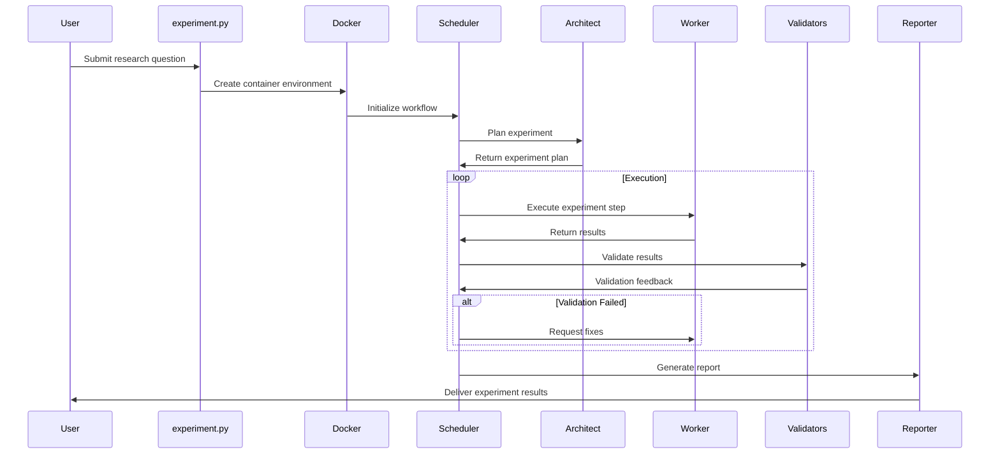
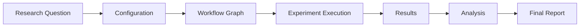

# Curie Architecture Diagram

## Overview

Curie is an AI-agent framework designed for automated and rigorous scientific experimentation. This diagram illustrates the architecture and workflow of the Curie system.

## System Architecture

```mermaid
graph TD
    subgraph "User Interface"
        UI[User Question/Experiment Request]
    end

    subgraph "Experiment Management"
        EM[experiment.py]
        Main[main.py]
        Config[Configuration]
    end

    subgraph "Agent Workflow"
        WF[construct_workflow_graph.py]
        
        subgraph "Core Agents"
            Arch[Architect]
            Worker[Worker]
            CWorker[Control Worker]
        end
        
        subgraph "Validators"
            LLM[LLM Validator]
            Patch[Patcher]
            Analyzer[Analyzer]
            Concluder[Concluder]
        end
        
        Sched[Scheduler]
        UserInput[User Input]
    end

    subgraph "Tools & Execution"
        Tools[tool.py]
        Docker[Docker Container]
    end

    subgraph "Output"
        Report[Reporter]
        Results[Experiment Results]
        Logs[Logs]
    end

    UI --> EM
    EM --> Main
    Main --> Config
    Config --> WF
    
    WF --> Sched
    Sched --> Arch
    Sched --> Worker
    Sched --> CWorker
    Sched --> LLM
    Sched --> Patch
    Sched --> Analyzer
    Sched --> Concluder
    Sched --> UserInput
    
    Arch --> Tools
    Worker --> Tools
    CWorker --> Tools
    
    Tools --> Docker
    Docker --> Results
    
    Results --> Report
    Results --> Logs
end
```

## Workflow Process



## Component Descriptions

### Core Components

- **experiment.py**: Entry point for users to submit research questions
- **main.py**: Orchestrates the experiment execution
- **construct_workflow_graph.py**: Builds the LangGraph workflow for agent interaction
- **scheduler.py**: Coordinates the workflow between different agents

### Agents

- **Architect**: Plans the experiment and research approach
- **Worker**: Executes the experiment steps (code, analysis)
- **Control Worker**: Alternative worker with different capabilities
- **Validators**:
  - LLM Validator: Validates experiment logic
  - Patcher: Fixes issues in experiment code
  - Analyzer: Analyzes experiment results
  - Concluder: Draws conclusions from the experiment

### Infrastructure

- **Docker**: Provides isolated environment for experiment execution
- **Reporter**: Generates final experiment reports
- **Tools**: Various tools for code execution, data analysis, etc.

## Data Flow


