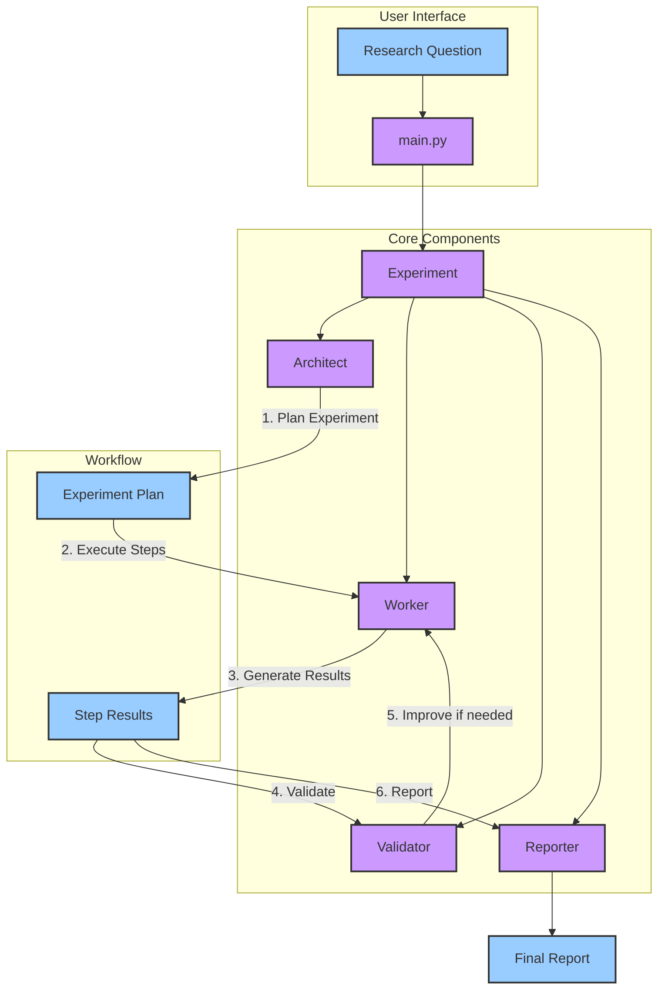

# Curie MVP: Scientific Experimentation Agent

This is a Minimum Viable Product (MVP) implementation of Curie, an AI-agent framework designed for automated scientific experimentation.

## Overview

Curie MVP provides a simplified version of the core components needed for automated experimentation:

1. **Experiment Planning**: The Architect agent plans experiment steps based on a research question
2. **Experiment Execution**: The Worker agent executes each step of the experiment
3. **Validation**: Validators check the quality and correctness of experiment steps
4. **Reporting**: Generates comprehensive research reports with results and conclusions

## Key Features

- Simple API for running automated experiments from research questions
- Modular architecture following the original Curie design
- Support for different types of research questions (general science, machine learning, data analysis)
- Experiment validation to ensure scientific rigor
- Markdown report generation

## Project Structure

```
rebuild/
├── src/               # Core source code
│   ├── __init__.py    # Package initialization
│   ├── experiment.py  # Main experiment workflow
│   ├── architect.py   # Experiment planning
│   ├── worker.py      # Experiment execution
│   ├── validator.py   # Validation components
│   ├── reporter.py    # Report generation
│   └── main.py        # Entry point
├── prompts/           # Prompt templates
├── scripts/           # Helper scripts
├── setup.py           # Package setup file
└── README.md          # This file
```

## Architecture

The following diagram shows the architecture and workflow of the Curie MVP:



## Usage

```python
from rebuild.src.main import curie

# Run an experiment with a research question
result = curie(
    question="How does the choice of sorting algorithm impact runtime performance across different input distributions?",
    api_keys={
        "OPENAI_API_KEY": "your-api-key",  # Optional
    }
)

# The experiment will:
# 1. Plan the experiment steps
# 2. Execute each step
# 3. Validate and improve results
# 4. Generate a comprehensive report

# Check the output directory for results
```

## Differences from Full Curie

This MVP focuses on the core workflow and omits some features from the full Curie system:

- No Docker containerization for code execution
- Simulated execution instead of actual code running
- Simplified agent interactions without LangGraph
- Limited validation capabilities

## Future Improvements

To evolve this MVP into a more complete Curie implementation:

1. Add Docker-based secure execution environment
2. Implement full LLM integration for all agents
3. Add LangGraph for more sophisticated agent workflows
4. Implement more rigorous validation protocols
5. Add support for real dataset processing

## Requirements

- Python 3.8+
- Dependencies listed in setup.py
